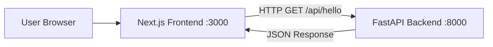

# Full-Stack Hello World Application

[](./DEPLOYMENT.md)
[](./docker-compose.yaml)
[](https://nextjs.org/)
[](https://fastapi.tiangolo.com/)

A modern full-stack web application demonstrating frontend-backend communication using industry-standard technologies. This project serves as a template and learning resource for building scalable web applications.

## 🎯 Objective

Create a basic full-stack application where a Next.js frontend fetches and displays data from a FastAPI backend, showcasing:
- Type-safe API communication
- Modern UI with responsive design
- Clean Architecture principles
- Docker containerization
- Professional development setup

## 🏗️ Architecture



The application follows a client-server architecture:
1. **Frontend (Next.js)**: Runs on port 3000, provides the user interface
2. **Backend (FastAPI)**: Runs on port 8000, serves API endpoints
3. **Communication**: Frontend fetches data from backend via REST API

## 📚 Documentation Structure

All documentation is organized in the `docs/` directory:

- **[docs/README.md](./docs/README.md)** - Documentation overview and navigation
- **[docs/deployment/](./docs/deployment/)** - Complete deployment guides
  - [START_HERE.md](./docs/deployment/START_HERE.md) - Quick start guide
  - [GUIDE.md](./docs/deployment/GUIDE.md) - Comprehensive guide for all platforms
  - [QUICK.md](./docs/deployment/QUICK.md) - Quick reference
  - [INDEX.md](./docs/deployment/INDEX.md) - Navigation guide

## 📁 Project Structure

```
3.Website/
├── docs/                        # Documentation
│   ├── README.md               # Documentation overview
│   └── deployment/             # Deployment guides
│       ├── START_HERE.md       # Quick start
│       ├── GUIDE.md            # Complete guide
│       ├── QUICK.md            # Quick reference
│       ├── SUMMARY.md          # Overview
│       ├── INDEX.md            # Navigation
│       └── CHANGES.md          # Change log
│
├── frontend/                    # Next.js Frontend Application
│   ├── src/
│   │   └── app/
│   │       ├── page.tsx        # Main page with API integration
│   │       ├── layout.tsx      # Root layout component
│   │       └── globals.css     # Global styles
│   ├── Dockerfile              # Frontend container configuration
│   ├── package.json            # Node.js dependencies
│   ├── tsconfig.json           # TypeScript configuration
│   ├── tailwind.config.ts      # Tailwind CSS configuration
│   └── next.config.ts          # Next.js configuration
│
├── backend/                     # FastAPI Backend Application
│   ├── src/
│   │   └── hello_api/
│   │       ├── domain/         # Core business logic
│   │       │   └── models.py   # Pydantic models
│   │       ├── application/    # Use cases & services
│   │       │   └── hello_service.py
│   │       └── infrastructure/ # External integrations
│   │           └── api/
│   │               └── main.py # FastAPI application
│   ├── tests/
│   │   ├── conftest.py        # Test configuration
│   │   └── test_api.py        # API tests
│   ├── Dockerfile             # Backend container configuration
│   ├── pyproject.toml         # Python dependencies
│   └── Makefile              # Development automation
│
├── docker-compose.yaml        # Multi-container orchestration
├── README.md                  # This file
└── Quickstart.md             # Quick setup guide
```

## 🚀 Tech Stack

### Frontend
- **Next.js 15**: React framework with server-side rendering
- **React 18**: UI library
- **TypeScript**: Type safety and better developer experience
- **Tailwind CSS**: Utility-first CSS framework for modern styling

### Backend
- **FastAPI**: Modern, fast Python web framework
- **Pydantic**: Data validation using Python type annotations
- **Uvicorn**: ASGI server for running FastAPI
- **Loguru**: Advanced logging

### DevOps
- **Docker**: Containerization for consistent environments
- **Docker Compose**: Multi-container orchestration
- **uv**: Fast Python package installer

## 📋 Prerequisites

Choose one of the following setup methods:

### Option 1: Docker (Recommended for Beginners)
- [Docker Desktop](https://www.docker.com/products/docker-desktop/) (includes Docker Compose)

### Option 2: Local Development
- **Node.js**: v20 or higher ([Download](https://nodejs.org/))
- **Python**: 3.12 or higher ([Download](https://www.python.org/downloads/))
- **uv**: Python package installer ([Install](https://github.com/astral-sh/uv))

## 🛠️ Setup & Installation

### Quick Start with Docker (Easiest)

1. **Clone or navigate to the project directory**:
   ```bash
   cd /path/to/3.Website
   ```

2. **Start both services**:
   ```bash
   docker-compose up --build
   ```

3. **Access the application**:
   - Frontend: http://localhost:3000
   - Backend API: http://localhost:8000/api/hello
   - API Documentation: http://localhost:8000/docs

4. **Stop the services**:
   ```bash
   docker-compose down
   ```

### Local Development Setup

#### Backend Setup

1. **Navigate to backend directory**:
   ```bash
   cd backend
   ```

2. **Install uv** (if not already installed):
   ```bash
   curl -LsSf https://astral.sh/uv/install.sh | sh
   ```

3. **Install dependencies**:
   ```bash
   make install
   ```

4. **Run the backend server**:
   ```bash
   make run
   ```

   The backend will be available at http://localhost:8000

5. **Run tests** (optional):
   ```bash
   make test
   ```

#### Frontend Setup

1. **Navigate to frontend directory** (in a new terminal):
   ```bash
   cd frontend
   ```

2. **Install dependencies**:
   ```bash
   npm install
   ```

3. **Run the development server**:
   ```bash
   npm run dev
   ```

   The frontend will be available at http://localhost:3000

## 🔌 API Endpoints

### Backend API

| Method | Endpoint | Description | Response |
|--------|----------|-------------|----------|
| GET | `/` | Health check | Status message |
| GET | `/api/hello` | Get hello message | HelloResponse object |
| GET | `/docs` | Interactive API documentation | Swagger UI |
| GET | `/redoc` | Alternative API documentation | ReDoc UI |

### Example Response

**GET /api/hello**
```json
{
  "message": "Hello from FastAPI! 🚀",
  "timestamp": "2025-12-26T10:30:00.123456",
  "version": "1.0.0"
}
```

## 🎨 Features

- ✅ **Full-stack Integration**: Complete frontend-backend communication
- ✅ **Type Safety**: TypeScript on frontend, Pydantic on backend
- ✅ **Modern UI**: Beautiful, responsive design with Tailwind CSS
- ✅ **Clean Architecture**: Backend follows hexagonal architecture principles
- ✅ **API Documentation**: Auto-generated with FastAPI
- ✅ **Error Handling**: Comprehensive error messages and loading states
- ✅ **CORS Configuration**: Properly configured for local development
- ✅ **Docker Support**: Easy deployment with containerization
- ✅ **Hot Reload**: Development servers auto-reload on code changes
- ✅ **Testing**: Includes API tests for backend

## 🧪 Testing

### Backend Tests

```bash
cd backend
make test
```

Tests include:
- Root endpoint health check
- Hello API endpoint validation
- Response structure verification
- API documentation availability
- CORS headers verification

## 📝 Development Workflow

1. **Start Services**: Use Docker Compose or run backend and frontend separately
2. **Make Changes**: Edit code files with hot-reload enabled
3. **Test Changes**: View results immediately in browser
4. **Run Tests**: Verify functionality with automated tests
5. **Build for Production**: Use Docker Compose for production builds

## 🔧 Configuration

### Backend Environment Variables

Create `backend/.env` from `backend/.env.example`:

```env
APP_NAME=Hello API
APP_VERSION=1.0.0
HOST=0.0.0.0
PORT=8000
LOG_LEVEL=INFO
```

### Frontend Environment Variables

Create `frontend/.env.local` from `frontend/.env.local.example`:

```env
NEXT_PUBLIC_API_URL=http://localhost:8000
```

## 🐛 Troubleshooting

### Backend not starting
- Ensure Python 3.12+ is installed: `python --version`
- Check if port 8000 is already in use: `lsof -i :8000`
- Verify dependencies are installed: `cd backend && make install`

### Frontend not starting
- Ensure Node.js 20+ is installed: `node --version`
- Check if port 3000 is already in use: `lsof -i :3000`
- Clear node_modules and reinstall: `rm -rf node_modules && npm install`

### Frontend can't connect to backend
- Verify backend is running: Visit http://localhost:8000
- Check CORS configuration in `backend/src/hello_api/infrastructure/api/main.py`
- Ensure correct API URL in frontend code

### Docker issues
- Ensure Docker Desktop is running
- Clear Docker cache: `docker-compose down -v && docker system prune -a`
- Rebuild containers: `docker-compose up --build --force-recreate`

## 📚 Learn More

### Next.js Resources
- [Next.js Documentation](https://nextjs.org/docs)
- [Learn Next.js](https://nextjs.org/learn)
- [Next.js GitHub](https://github.com/vercel/next.js)

### FastAPI Resources
- [FastAPI Documentation](https://fastapi.tiangolo.com/)
- [FastAPI Tutorial](https://fastapi.tiangolo.com/tutorial/)
- [Pydantic Documentation](https://docs.pydantic.dev/)

### Tailwind CSS
- [Tailwind CSS Documentation](https://tailwindcss.com/docs)
- [Tailwind CSS Tutorial](https://tailwindcss.com/docs/utility-first)

## 🤝 Contributing

This is a learning project. Feel free to:
- Experiment with the code
- Add new features
- Improve documentation
- Share feedback

## 📄 License

This project is open source and available for educational purposes.

## 🚀 Deployment

**Your app is 100% ready for deployment!** 

### 🎯 Quick Start

**Local (1 minute):**
```bash
./deploy-local.sh
```

**Cloud (10 minutes):**
See **[docs/deployment/START_HERE.md](./docs/deployment/START_HERE.md)** for step-by-step Render deployment

### 📚 Deployment Documentation

| Guide | Purpose | Time |
|-------|---------|------|
| **[docs/deployment/START_HERE.md](./docs/deployment/START_HERE.md)** | 🎯 **Start here!** Quick deploy guide | 2 min |
| **[docs/deployment/README.md](./docs/deployment/README.md)** | Platform comparison & navigation | 5 min |
| **[docs/deployment/local.md](./docs/deployment/local.md)** | Local Docker deployment | 1 min |
| **[docs/deployment/render.md](./docs/deployment/render.md)** | Deploy to Render (easiest) | 10 min |
| **[docs/deployment/railway.md](./docs/deployment/railway.md)** | Deploy to Railway (fast) | 5 min |
| **[docs/deployment/vercel.md](./docs/deployment/vercel.md)** | Vercel + Render (best Next.js) | 15 min |

### 🛠️ Helper Scripts

```bash
./deploy-local.sh        # Deploy locally with Docker
./deploy-check.sh        # Pre-deployment verification
./check-deployment.sh    # Check deployment status
```

### 🌐 Supported Platforms

1. **Render** - Easiest, free tier available
2. **Railway** - Fast, $5/month credit
3. **Vercel + Render** - Best Next.js performance
4. **DigitalOcean** - Managed platform, $10/month
5. **Fly.io** - Docker-focused, edge computing
6. **AWS ECS/Fargate** - Enterprise-grade

**See [docs/deployment/README.md](./docs/deployment/README.md) for all platform guides and comparison.**

## 👨‍💻 Next Steps

Now that you have a working full-stack application, consider:

1. **Deploy to Production**: Follow [DEPLOYMENT.md](./DEPLOYMENT.md) guide
2. **Add Database**: Integrate PostgreSQL or MongoDB
3. **Add Authentication**: Implement user login/signup
4. **Add More Endpoints**: Create CRUD operations
5. **Add State Management**: Use Redux or Zustand for complex state
6. **Add Testing**: Expand test coverage on both frontend and backend
7. **Set up CI/CD**: Automate deployment with GitHub Actions
8. **Add Monitoring**: Integrate Sentry, LogRocket, or similar tools

Happy coding! 🚀

